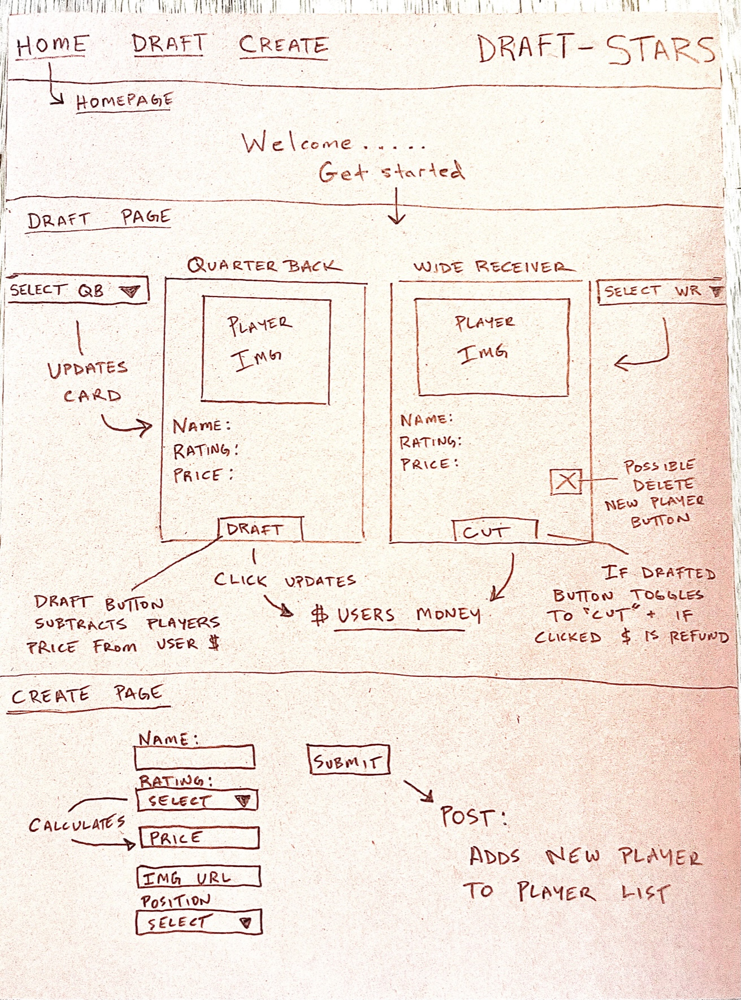

# draft-stars
Fantasy football type application

USER STORY:
 
Draft-Stars 

As a user I should be able to :

- Land on a Homepage perhaps explaining the rules
- Navigate the NavBar to direct me to different sections
- Draft one quarterback and one wide receiver 
- Select from a list of top 10 default NFL quarterbacks/wide receivers and have their card show up with stats
- Draft players as long as they are within the budget allowed (higher rated players are more expensive)
- Cut players to refund money in order to draft different players
- Create a new player setting a name, rating, (price may be equated based off rating), image, and select QB or WR for position

- Optional: when a new player is created, they have a delete button added property to their card so only newly created players can be deleted

- For new player creation copy/paste

Joe Montana
https://static.www.nfl.com/image/private/t_player_profile_landscape_2x/f_auto/league/ueq3x4ldeixk2h5wq3n7

Jerry Rice 
https://static.www.nfl.com/image/private/t_player_profile_landscape_2x/f_auto/league/g1vjcnbryx3nmg0ppsnl